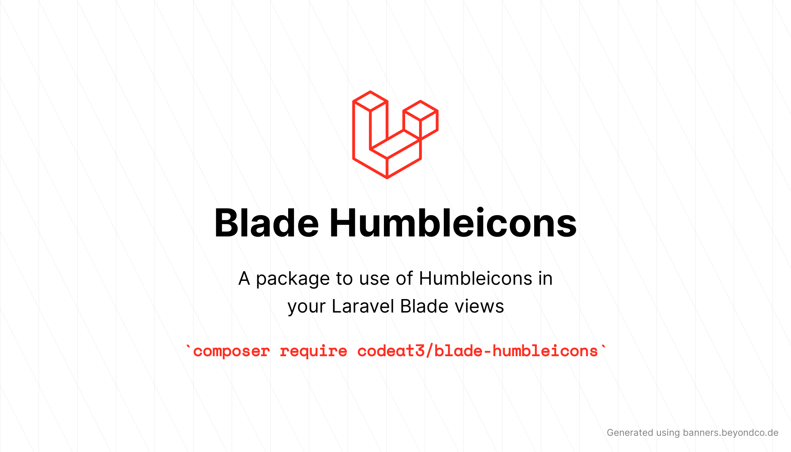

<p align="center">
    
</p>

# Blade Humbleicons

<a href="https://github.com/codeat3/blade-humbleicons/actions?query=workflow%3ATests">
    
</a>
<a href="https://packagist.org/packages/codeat3/blade-humbleicons">
    
</a>
<a href="https://packagist.org/packages/codeat3/blade-humbleicons">
    
</a>

A package to easily make use of [Humbleicons](https://github.com/zraly/humbleicons) in your Laravel Blade views.

For a full list of available icons see [the SVG directory](resources/svg) or preview them at [humbleicons.com](https://humbleicons.com/).

## Requirements

- PHP 7.4 or higher
- Laravel 8.0 or higher

## Installation

```bash
composer require codeat3/blade-humbleicons
```

## Updating

Please refer to [`the upgrade guide`](UPGRADE.md) when updating the library.

## Blade Icons

Blade Humbleicons uses Blade Icons under the hood. Please refer to [the Blade Icons readme](https://github.com/blade-ui-kit/blade-icons) for additional functionality. We also recommend to [enable icon caching](https://github.com/blade-ui-kit/blade-icons#caching) with this library.

## Caching Icons

It's a good idea to add the `icons:cache` command as part of your deployment pipeline and always cache icons in production. This will significantly improve performance of the application. Refer [Caching](https://github.com/driesvints/blade-icons?tab=readme-ov-file#caching) section for details.

## Configuration

Blade Humbleicons also offers the ability to use features from Blade Icons like default classes, default attributes, etc. If you'd like to configure these, publish the `blade-humbleicons.php` config file:

```bash
php artisan vendor:publish --tag=blade-humbleicons-config
```

## Usage

Icons can be used as self-closing Blade components which will be compiled to SVG icons:

```blade
<x-humble-aid/>
```

You can also pass classes to your icon components:

```blade
<x-humble-aid class="w-6 h-6 text-gray-500"/>
```

And even use inline styles:

```blade
<x-humble-aid style="color: #555"/>
```

### Raw SVG Icons

If you want to use the raw SVG icons as assets, you can publish them using:

```bash
php artisan vendor:publish --tag=blade-humbleicons --force
```

Then use them in your views like:

```blade

```

## Changelog

Check out the [CHANGELOG](CHANGELOG.md) in this repository for all the recent changes.

## Maintainers

Blade Humbleicons is developed and maintained by [Swapnil Sarwe](https://swapnilsarwe.com).

## License

Blade Humbleicons is open-sourced software licensed under [the MIT license](LICENSE.md).
